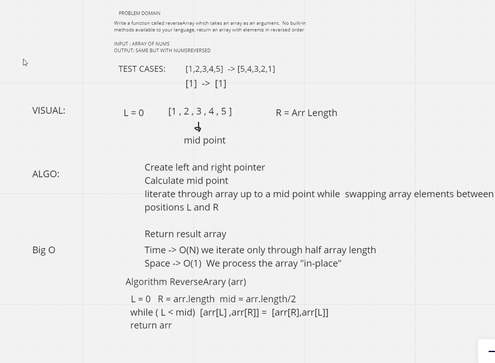

# Reverse an Array

    Write a function called reverseArray which takes an array as an argument. Without utilizing any of the built-in methods available to your language, return an array with elements in reversed order.

## Whiteboard Process

## Approach & Efficiency    
time -> O(N)
space -> O(1)
Iterate to the mid-poit swapping values
<!-- What approach did you take? Discuss Why. What is the Big O space/time for this approach? -->